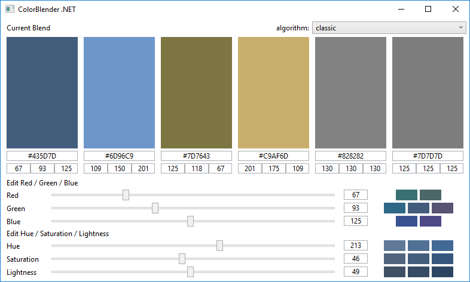

# ColorBlender

[](https://ci.appveyor.com/project/wieslawsoltes/colorblender/branch/master)
[](https://travis-ci.org/wieslawsoltes/ColorBlender)
[](https://circleci.com/gh/wieslawsoltes/ColorBlender/tree/master)
[](https://dev.azure.com/wieslawsoltes/ColorBlender/_build/latest?definitionId=1)

[](https://www.nuget.org/packages/ColorBlender)

A .NET library for color matching and palette design.

## About

ColorBlender is a .NET library for color matching and palette design.

ColorBlender .NET version is based on sources from: http://www.colorblender.com/

The old version of ColorBlender can be found here: http://www.colormatch5k.com/
The new version of ColorBlender can be found here: http://www.colorexplorer.com/colormatch.aspx

## Algorithms

Color matching algorithms:
* classic - ColorMatch 5K Classic
* colorexplorer - ColorExplorer - "Sweet Spot Offset"
* singlehue - Single Hue
* complementary - Complementary
* splitcomplementary - Split-Complementary
* analogue - Analogue
* triadic - Triadic
* square - Square

All work is done in HSV color space, because all
calculations are based on hue, saturation and value of the working color.

The hue spectrum is divided into sections, are the matching colors are
calculated differently depending on the hue of the color.

## NuGet

ColorBlender is delivered as a NuGet package.

You can find the package [here](https://www.nuget.org/packages/ColorBlender/).

You can install the package like this:

`Install-Package ColorBlender`

## Sample

```C#
using System;
using ColorBlender;
using ColorBlender.Colors;
using ColorBlender.Algorithms;

namespace ColorBlenderConsole
{
    class Program
    {
        static void Main(string[] args)
        {
            Console.WriteLine("Classic");
            Match(new Classic(), new HSV(213, 46, 49));
            Console.WriteLine("ColorExplorer");
            Match(new ColorExplorer(), new HSV(213, 46, 49));
            Console.ReadKey();
        }

        private static void Match(IAlgorithm algorithm, HSV hsv)
        {
            var blend = algorithm.Match(hsv);
            foreach (var color in blend.Colors)
            {
                var rgb = color.ToRGB();
                var html = string.Format(
                    "#{0:X2}{1:X2}{2:X2}",
                    (byte)rgb.R, (byte)rgb.G, (byte)rgb.B);
                Console.WriteLine(html);
            }
        }
    }
}
```

## Screenshots




## License

ColorBlender is licensed under the [MIT license](LICENSE.TXT).
